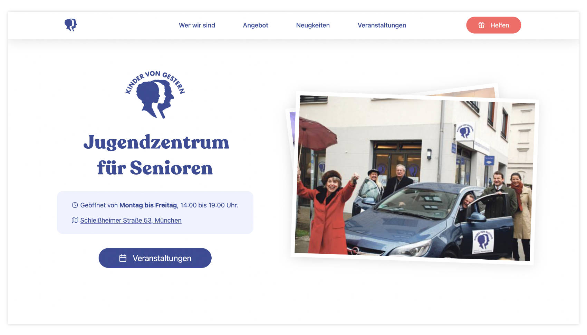

# Kinder von gestern

Kinder von gestern is a German non-profit that tries to put and end to old-age related loneliness. They build spaces for senior-citizens to meet, eat, and partake in various activities.

[Visit Kinder von gestern](https://kinder-von-gestern.vercel.app)

